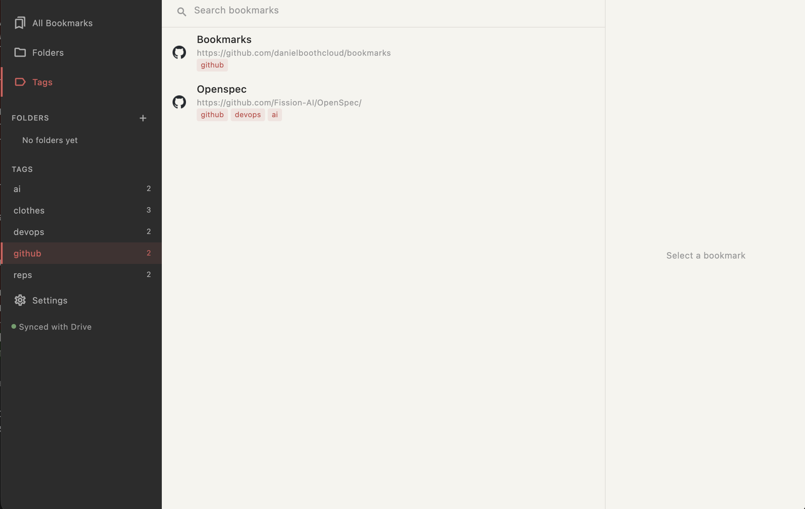

# bookmarks

A desktop bookmark manager for macOS, Linux, and Windows. Local-first,
syncs to your own Google Drive, no servers in between.



## What it does

- **Save URLs and organise them.** Folders for hierarchy, tags for
  cross-cutting collections. A bookmark can live in one folder and
  carry as many tags as you want.
- **Find anything fast.** Full-text search across titles, URLs, and
  tags from a single bar at the top.
- **Import from your browser.** Drop in a Chrome, Firefox, or Safari
  bookmarks export (`.html`) — folder structure is preserved, and
  favicons are fetched in the background so you don't wait.
- **Sync via your own Google Drive.** One sign-in, one file in your
  Drive (`bookmarks.json`). The app is the only thing that touches
  it. Edit on one machine, open the app on another, your library
  catches up. Last-write-wins per record, no merge conflicts to
  resolve by hand.
- **Works offline.** Everything is stored in a local SQLite database.
  Changes made will sync the next time your online
- **No telemetry. No analytics. No third-party error reporting.** The
  only network calls the app ever makes are to Google Drive (when
  you've connected it) and to favicon URLs.

## Install

Pre-built binaries: see the [Releases page](../../releases).

Build from source:

```bash
mise install                  # Flutter 3.41.9 + toolchain
mise run dev                  # macOS
mise run build-linux          # Linux desktop bundle
```

To enable Google Drive sync you'll need your own OAuth client. Drop
your `client-creds.json` (Google Cloud Console → OAuth 2.0 → Desktop
app) in the project root before running `mise run dev`.

## Under the hood

Flutter desktop · Drift (SQLite) · Riverpod · Google Drive v3.
Architecture notes live in `docs/`: [sync](docs/sync-model.md),
[auth](docs/auth-model.md), [import](docs/import-model.md),
[focus](docs/focus-model.md).

Developed with [Claude Code](https://claude.com/claude-code) using the
[BMAD-METHOD](https://github.com/bmad-code-org/BMAD-METHOD) workflow —
every feature went through a tech-spec, implementation, and adversarial
code review before landing.
